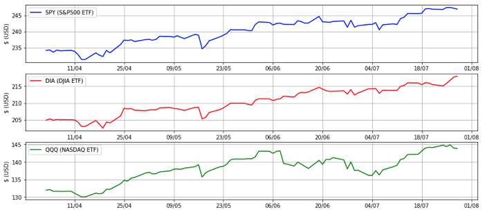
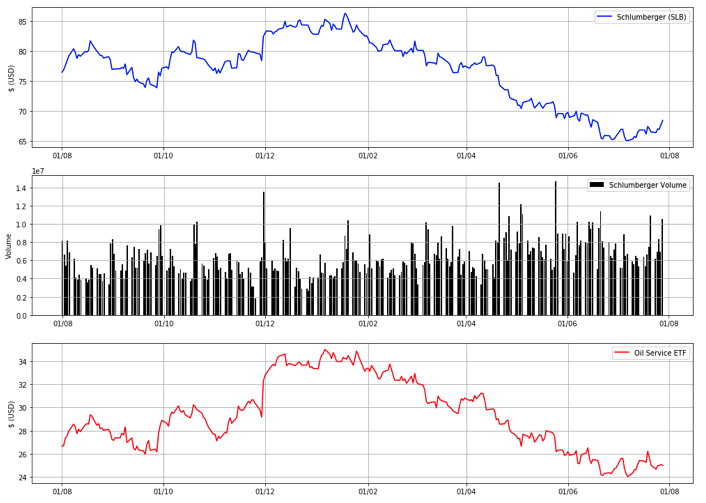

# Stock-Investing
This git repo is a mix of lessons and anaylsis tools that I assembled to appeal to any programmer who also has an interest in the equity markets.

## Market Outlook
Looks at all the major indices of the stock markets, using Exchange Traded Funds (ETFs) that track and influence the market. ETFs for Bonds, sectors, and industries are displayed, to get an overall outlook on what the major trends on wall street are.

## Catching Knifes
This notebook is lesson and tool for an investor that is looking for an entry point to an [value stock](https://l.messenger.com/l.php?u=https%3A%2F%2Fcdn.fbsbx.com%2Fv%2Ft59.2708-21%2F17865360_1393641913991827_2660045083759345664_n.zip%2FMCS-Report.zip%3Foh%3D90b3086b31f57135a9328e37f8ae1630%26oe%3D5988AFC0%26dl%3D1&h=ATOjcxeL2BvUraImaq_5oj-JNChcJcHkpZQXkZB7CHaQa91EZ_UABwA7uYw0ioeBWEMhoGwZgQhTz3vhSf67Y8qEMTVlFhfTvbk0ausEobMme37oKb8LrLxcoolqrNqtJ8TFw3f3btViSNiv_R5ybLCOUdLKEFc&s=1&enc=AZOCPhawuQp_M8gvA-yWaKDVnB-PVBEmVEDz4gmb1e-R0zQYbOlQEQsoc0vFTkNC1ksET987vJjaAzxoESWTW3zxAt2U1lR4N5V9p9JyJXM16g). For a value investor, trying to call to the floor on a security's falling price seems much like trying to catch a knife, and this notebook aims to share some technical anaylsis techniques to improve your odds.

## Machine Learning Conference Calls
The best way to learn about a company is to listen to the quatarly conference calls that occur each quarter when they release earnings. During earnings seasson, when hundreds of large companies host there conference calls, keeping up with all the news is impossible, as each call lasts about an hour. So by applying machine learning to summarize the transcipts of these calls for traders and mid-term investors to gain an edge in the earnings seasson madness. (Still in Development)
